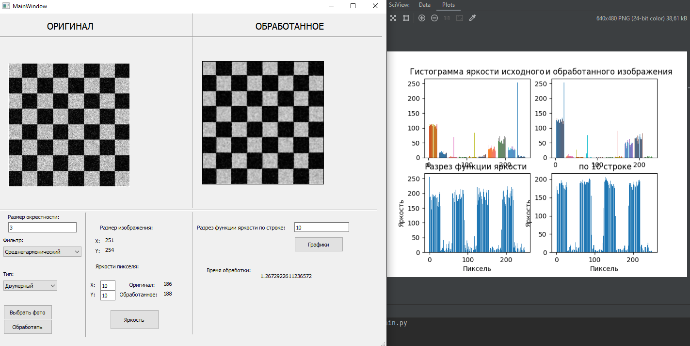

# Фильтрация изображения

## О репозитории
Приложение с реализованы следющий фильтры для изображений:
* одномерный среднегеометрический фильтр,
* двумерный среднегеометрический фильтр,
* одномерный среднегармонический фильтр,
* двумерный среднегармонический фильтр.

Среднегеометрический фильтр предназначен для размывания "белого" шума, среднегармонический - для размывания "белого" шума и подавления белого импульного шума.

## Содержимое репозитория
* `form.py` - интерфейс приложения,
* `main.py` - основная логика приложения,
* `test.bmp` и `test_2.bmp` - тестовые изображения.

## Пример работы приложения

