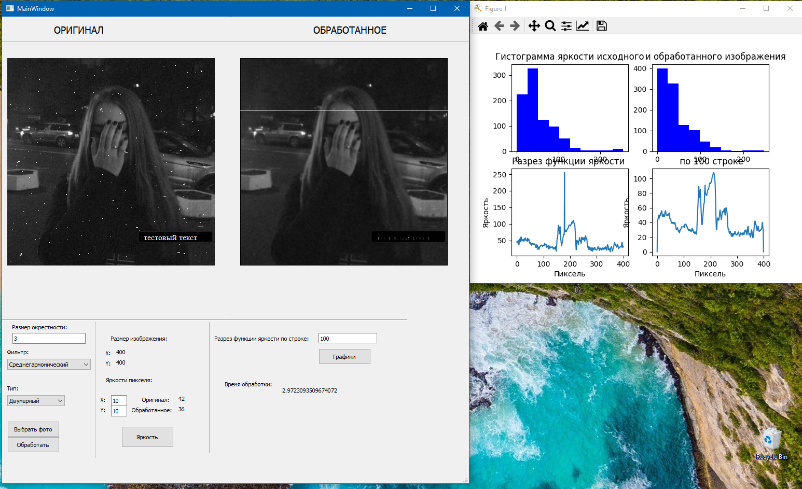

# Фильтрация изображения

## О репозитории
В приложении реализованы следующие фильтры изображений:
* одномерный среднегеометрический фильтр,
* двумерный среднегеометрический фильтр,
* одномерный среднегармонический фильтр,
* двумерный среднегармонический фильтр.

Среднегеометрический фильтр предназначен для размывания "белого" шума, среднегармонический - для размывания "белого" шума и подавления белого импульного шума.

## Содержимое репозитория
* `form.py` - интерфейс приложения,
* `main.py` - основная логика приложения,
* `test_images` - изображения с различными шумами,
* `untitled.ui` - QT_UI интерфейс приложения,
* `requirements.txt` - используемые зависимости.

## Пример работы приложения

